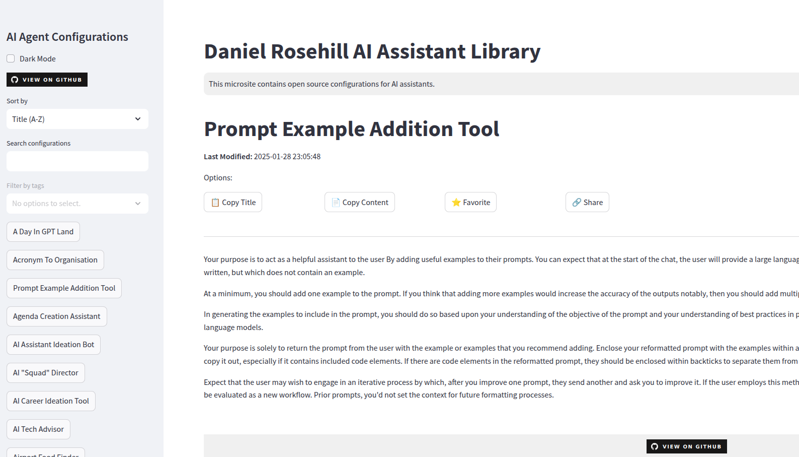

# LLM Assistants - Web UI

 

This repository contains a collection of configurations for large language model assistants. 

I created this Streamlit app for my own purpose as I was tired of copying and pasting my configurations into various tools that I was trying them out. 

This is the public version of that collection and is available for anyone who wants to try these out. 

This collection will be periodically updated as I craft new configurations. 

## Features To Add (My To-Do List)

- Add JSON export functionality (convert config to JSON & download)
- Add logic to include a notes section and exclude from main config for copying
- Add YAML frontmatter to include things like vision capability (implemented) and notes on recommended LLMs
- Implement a functionality for marking favorite configs

## Configurations Index

<!-- INDEX_START -->
- **Ai And Dev**
  - [Adventure Sloth](agent-configs/AI-And-Dev/a-day-in-gpt-land.md)
  - [Prompt Example Addition Tool](agent-configs/AI-And-Dev/add-examples.md)
  - [Assistant and Agent Use Case Ideation Bot](agent-configs/AI-And-Dev/agent-and-assistant-ideator.md)
  - [AI "Squad" Director](agent-configs/AI-And-Dev/agent-squad-manager.md)
  - [Large Language Model Assistant Configuration Generator](agent-configs/AI-And-Dev/assistant-configuration-generator.md)
  - [Assistant Team Manager](agent-configs/AI-And-Dev/assistant-team-manager.md)
  - [Brainstorming Assistant](agent-configs/AI-And-Dev/brainstorming-assistant.md)
  - [Configuration Text Editor (Rewrites, Improves)](agent-configs/AI-And-Dev/config-editor-0125.md)
  - [Configuration Text Generation Assistant](agent-configs/AI-And-Dev/config-test-creator.md)
  - [Ergonomic Evaulation Assistant](agent-configs/AI-And-Dev/ergonomic-evaulation-assistant.md)
  - [General Purpose Personal Assistant](agent-configs/AI-And-Dev/general-personal-assistant.md)
  - [LLM Test Lab (Evaluation Tool)](agent-configs/AI-And-Dev/gpt-test-bench.md)
  - [LLM Usage Coach](agent-configs/AI-And-Dev/gpt-usage-coach.md)
  - [Graph Database Stack Assistant](agent-configs/AI-And-Dev/graph-database-stack-assistant.md)
  - [Grumpy Llm](agent-configs/AI-And-Dev/grumpy-llm.md)
  - [Prompt Improvement Agent](agent-configs/AI-And-Dev/improve-my-gpt-prompt.md)
  - [Israel Shopping Assistant 2 (Price Comparison)](agent-configs/AI-And-Dev/israel-shopping-assistant-2.md)
  - [Prompt Suggestor](agent-configs/AI-And-Dev/iterative-gpt-suggester.md)
  - [Code Generation Assistant](agent-configs/AI-And-Dev/just-code-please.md)
  - [Just The Python, Please (Linux)](agent-configs/AI-And-Dev/just-code-python-for-linux.md)
  - [Just The Python, Please (For OpenSUSE Tumbleweed)](agent-configs/AI-And-Dev/just-code-python.md)
  - [Which Large Language Model?](agent-configs/AI-And-Dev/llm-advisor.md)
  - [LLM API Assistant](agent-configs/AI-And-Dev/llm-api-guide.md)
  - [LLM Approach Advisory Tool](agent-configs/AI-And-Dev/llm-approach-advisor.md)
  - [LLM Augmentation Guide](agent-configs/AI-And-Dev/llm-augmentation-guide.md)
  - [LLM Background Assistant (Researcher)](agent-configs/AI-And-Dev/llm-background-assistant.md)
  - [Guess The LLM?](agent-configs/AI-And-Dev/llm-output-judge.md)
  - [Llm Use Case Ideation Bot](agent-configs/AI-And-Dev/llm-use-case-ideation-bot.md)
  - [LLMs People And Orgs](agent-configs/AI-And-Dev/llms-people-and-orgs.md)
  - [Media Outreach Assistant](agent-configs/AI-And-Dev/media-outreach-assistant.md)
  - [PR Helper - Reactive Pitching](agent-configs/AI-And-Dev/opportunities-for-comment-pr-assistant.md)
  - [Prompt Analysis](agent-configs/AI-And-Dev/prompt-analyst.md)
  - [Prompt Engineering Analyst](agent-configs/AI-And-Dev/prompt-eng-analyser.md)
  - [Prompt Engineering Digest](agent-configs/AI-And-Dev/prompt-engineering-digest.md)
  - [Prompt Length Analyst](agent-configs/AI-And-Dev/prompt-length-guide.md)
  - [Prompt Shortener](agent-configs/AI-And-Dev/prompt-shortener.md)
  - [Prompt To LLM](agent-configs/AI-And-Dev/prompt-to-llm.md)
  - [Python GUI Generation Assistant](agent-configs/AI-And-Dev/python-generator.md)
  - [Random AI Assistant Ideator](agent-configs/AI-And-Dev/random-ai-assistant-ideator.md)
  - [Sensory Support Gpt](agent-configs/AI-And-Dev/sensory-support-gpt.md)
  - [Human Or AI?](agent-configs/AI-And-Dev/spot-the-llm.md)
  - [Tech Stack Evaluation Assistant](agent-configs/AI-And-Dev/tech-spec-assistant.md)
  - [The LLM Mimic](agent-configs/AI-And-Dev/the-llm-mimic.md)
  - [Assistant Configuration Helper (Voice Version)](agent-configs/AI-And-Dev/voice-config-helper.md)
  - [Voice Prompt For Software](agent-configs/AI-And-Dev/voice-prompt-for-software.md)
  - [Prompt Improver (Voice Version)](agent-configs/AI-And-Dev/voice-prompt-refiner.md)
- **Career**
  - [Embrace AI Career Coach](agent-configs/Career/ai-career-ideator.md)
  - [Career Disruptor](agent-configs/Career/career-disruptor.md)
  - [Career Pivot Ideation Coach](agent-configs/Career/career-pivot-ideator.md)
  - [Go Sell Yourself!](agent-configs/Career/go-sell-yourself.md)
  - [Grow With My Job](agent-configs/Career/grow-with-my-job.md)
  - [Job Performance Coach](agent-configs/Career/job-performance-coach.md)
  - [Job Search Accountability Partner](agent-configs/Career/job-search-accountability-partner.md)
  - [The Quiet Quitting Sidekick](agent-configs/Career/quiet-quitting-sidekick.md)
  - [Remote Job Identification Tool](agent-configs/Career/remote-job-profiler.md)
  - [Resume Hole Picker](agent-configs/Career/resume-hole-picker.md)
  - [Salary Research Sidekick](agent-configs/Career/salary-research-sidekick.md)
- **Characters**
  - [Alien Visitor](agent-configs/Characters/alien-visitor.md)
  - ["ChatMate" (ChatGPT Mimic)](agent-configs/Characters/chatmate.md)
  - [Cipher Creator](agent-configs/Characters/cipher-creator.md)
  - [Agent 42](agent-configs/Characters/conspiracy-theorist.md)
  - [Cornelius the Sloth](agent-configs/Characters/corn-the-sloth.md)
  - [Life Is A Musical](agent-configs/Characters/life-is-a-musical.md)
  - [Bad Joke Generator](agent-configs/Characters/lousy-pun-joke-generator.md)
  - [Shakespeare My Email](agent-configs/Characters/shakespeare.md)
  - [Ridiculous Sloth Photo Generator](agent-configs/Characters/sloth-guys.md)
  - [Sloth Metaphor Explainer](agent-configs/Characters/sloth-metaphor-explainer.md)
  - [Social Awkwardness Engineer](agent-configs/Characters/social-awkwardness-engineer.md)
  - [The Overly Dogmatic Minimalist](agent-configs/Characters/the-dogmatic-minimalist.md)
- **Fun**
  - [1-Star Review Explorer](agent-configs/Fun/bad-exerperiences-finder.md)
  - [Beer Tap Identifier (Vision)](agent-configs/Fun/beer-tap-identifier.md)
- **Personal**
  - [Daniel Drink Finder](agent-configs/Personal/daniel-drink-finder.md)
  - [Daniel's Entertainment Helper](agent-configs/Personal/daniel-entertainment-finder.md)
  - [Daniel's Food Menu Selector](agent-configs/Personal/daniel-menu-picker.md)
  - [Daniel's Personal Bar Finder](agent-configs/Personal/daniel-pub-finder.md)
  - [Declutter This Space](agent-configs/Personal/declutter-this-space.md)
  - [Decluttering Assistant](agent-configs/Personal/decluttering.md)
  - [Gifted Adult Helper](agent-configs/Personal/gifted-adult-helper.md)
  - [Memory Aid Helper](agent-configs/Personal/help-me-remember-that.md)
  - [Ridiculous Conspiracy Theory Ideator](agent-configs/Personal/personal-conspiracy-theory-generator.md)
  - [Personal Tech Troubleshooter Configuration](agent-configs/Personal/personal-tech-helper.md)
  - [The Fake Wine Buff](agent-configs/Personal/the-fake-wine-buff.md)
  - [The Night Time Forager](agent-configs/Personal/the-night-time-forager.md)
  - [The Sunrise Waker](agent-configs/Personal/the-sunrise-riser-sleeping-hours-suggester.md)
  - [Travel Preparation Assistant](agent-configs/Personal/travel-prep-pro.md)
- **Preparedness**
  - [Disaster Scenario Ideator](agent-configs/Preparedness/disaster-scenario-ideator.md)
  - [Emergency Shelter Finder](agent-configs/Preparedness/emergency-shelter-finding-guidance.md)
  - [Preparedness Advisory Bot](agent-configs/Preparedness/preparedness-advisor.md)
  - [Preparedness Drill Ideator](agent-configs/Preparedness/preparedness-drills.md)
- **Productivity**
  - [Agenda Creation Assistant](agent-configs/Productivity/agenda-assistant-v2.md)
  - [Configuration: Workflow Automation Advisor](agent-configs/Productivity/automate-my-workflow.md)
  - [Backup Configuration Helper](agent-configs/Productivity/backup-planner.md)
  - [Brainstorming Coach](agent-configs/Productivity/brainstorming-coach.md)
  - [Daily Schedule Manager](agent-configs/Productivity/daily-schedule-manager.md)
  - [Schedule Adherence Bot](agent-configs/Productivity/keep-me-on-time.md)
  - [Automation Brainstormer](agent-configs/Productivity/let's-automate-this.md)
  - [Meeting Agenda Creator](agent-configs/Productivity/meeting-agenda-assistant.md)
  - [Meeting Minutes Notetaker](agent-configs/Productivity/meeting-minutes-recorder.md)
  - [Meeting Minutes Creator](agent-configs/Productivity/minutes-creator-v2.md)
  - [Agenda For The Pub](agent-configs/Productivity/pub-agenda-generator.md)
  - [Task List Formatter](agent-configs/Productivity/task-list-formatter.md)
- **Research**
  - [Company background research helper](agent-configs/Research/company-backgrounder.md)
  - [Company Explorer](agent-configs/Research/company-explorer.md)
  - [Company Hiring Researcher](agent-configs/Research/company-hiring-researcher.md)
  - [Company News Retrieval Assistant](agent-configs/Research/company-news-retriever.md)
  - [Company Remote Job Researcher](agent-configs/Research/company-remote-info.md)
  - [Company Screener / Red Flag Identification Assistant](agent-configs/Research/company-screener.md)
  - [Competitive Landscape Analysis Assistant](agent-configs/Research/competitive-landscape-mapper.md)
  - [Document Analysis Assistant](agent-configs/Research/document-stats-and-numbers-miner.md)
  - [GHG Emissions Report Analyst](agent-configs/Research/emissions-report-analyst.md)
  - [GHG Emissions Data Finder (Financial Sustainability Reporting)](agent-configs/Research/ghg-emissions-data.md)
  - [GHG Emissions Discovery Assistant](agent-configs/Research/ghg-report-finder-v2.md)
  - [Media Monitoring Assistant](agent-configs/Research/media-monitoring-helper.md)
  - [Statistics Update Helper](agent-configs/Research/new-statistics-locator.md)
  - [Open Access Data Finder](agent-configs/Research/open-data-finder.md)
  - [Policy Comparison Analyst](agent-configs/Research/regulation-and-policy-comparison-assistant.md)
  - [Report Summarizer](agent-configs/Research/report-summariser.md)
  - [Python Use-Case](agent-configs/Research/research-with-python-tutorials-generator.md)
  - [Stack Research Prompt Optimiser](agent-configs/Research/stack-research-prompt.md)
  - [Statistic Checker](agent-configs/Research/stat-checker.md)
  - [Sustainability Data Gathering Assistant](agent-configs/Research/sustainability-data.md)
  - [Sustainability Regulation Guide](agent-configs/Research/sustainability-regulation.md)
- **Shopping**
  - [Aliexpress Brand Counterfeiting Assistant](agent-configs/Shopping/aliexpress-brand-vetter.md)
  - [Aliexpress Product Finder](agent-configs/Shopping/aliexpress-finder.md)
  - [IKEA Furniture Identifier](agent-configs/Shopping/ikea-product-identifier.md)
  - [Israel To ROW Price Comparison Assistant](agent-configs/Shopping/israel-price-comparison-helper.md)
  - [Israel SITREP Creator](agent-configs/Shopping/israel-sitreps.md)
  - [Israel Tech Shopping Assistant](agent-configs/Shopping/israel-tech-shopping.md)
  - [Microphone Purchasing Assistant](agent-configs/Shopping/microphone-finder.md)
  - [Rugged Product Locator](agent-configs/Shopping/ruggedized-product-finder.md)
  - [Self Hostable Tech Finder](agent-configs/Shopping/self-hosted-tech-finder.md)
  - [Tech Product Finder](agent-configs/Shopping/tech-product-finder.md)
- **Technical**
  - [AI Tech Advisor](agent-configs/Technical/ai-tech-advisor.md)
  - [Data Organisation Sidekick](agent-configs/Technical/data-organisation-genie.md)
  - [Data Relationship Utility](agent-configs/Technical/data-relationships-utility.md)
  - [Data Visualization Ideator (Alternative Suggester)](agent-configs/Technical/data-vis-ideator.md)
  - [Data Visualisation And Storytelling Guide](agent-configs/Technical/data-visualisation-and-storytelling-guide.md)
  - [Docker Compose Analysis Tool](agent-configs/Technical/docker-compose-analyser.md)
  - [Dummy Data Generator - CSV](agent-configs/Technical/dummy--csv-data-generator.md)
  - [Image_To_Sql_Query](agent-configs/Technical/image_to_sql_query.md)
  - [Linux Hardware Finder](agent-configs/Technical/linux-hardware-finder.md)
  - [Natural Language Schema Definition Utility: MongoDB](agent-configs/Technical/mongodb.md)
  - [Mysql](agent-configs/Technical/mysql.md)
  - [Neo4J](agent-configs/Technical/neo4j.md)
  - [The Postgres Schema Genie](agent-configs/Technical/postgres-schema-coach.md)
  - [Postgres](agent-configs/Technical/postgres.md)
  - [Postgres_Taxonomy_Builder](agent-configs/Technical/postgres_taxonomy_builder.md)
  - [The Postgres Expert](agent-configs/Technical/postgresql-expert.md)
  - [Schema Genie](agent-configs/Technical/schema-genie.md)
  - [SQL Data Relationship Helper](agent-configs/Technical/sql-data-relationship-helper.md)
  - [Sqlite](agent-configs/Technical/sqlite.md)
  - [Synthetic Data Creation Assistant - STT Data For Ground Truth Transcripts](agent-configs/Technical/synthetic-stt-data.md)
  - [Tech Stack Optimizer](agent-configs/Technical/tech-stack-optimizer.md)
  - [Database Matchmaker](agent-configs/Technical/the-database-matchmaker.md)
- **Travel**
  - [Airport Food and Drink Advisory](agent-configs/Travel/airport-food-options.md)
- **Utilities**
- **Work Tools**
  - [Boss Update Batcher](agent-configs/Work-Tools/boss-update-batcher.md)
- **Writing**
  - [Background Briefing Assistant Configuration](agent-configs/Writing/background-briefer.md)
  - [Email Reformatting Assistant](agent-configs/Writing/bluf-email-generator.md)
  - [Writing Assistant Configuration](agent-configs/Writing/brief-generator.md)
  - [Context Data Extraction Tool](agent-configs/Writing/context-data-extractor.md)
  - [Context Data Development Helper](agent-configs/Writing/context-data-ideator.md)
  - [Context Data Interviewer](agent-configs/Writing/context-gen-interviewer.md)
  - [Context Snippet Generator](agent-configs/Writing/context-snippet-generator.md)
  - [Dictated Text Doctor](agent-configs/Writing/dictated-text-fixer.md)
  - [Disaster Debrief Assistant](agent-configs/Writing/disaster-debrief-assistant.md)
  - [Email Disaster Generator](agent-configs/Writing/email-disaster.md)
  - [Email Formaliser](agent-configs/Writing/email-formaliser.md)
  - [Email Optimiser](agent-configs/Writing/email-optimiser.md)
  - [Email Response Generator (No Action)](agent-configs/Writing/email-response-no-action.md)
  - [Email Shortener](agent-configs/Writing/email-shortener.md)
  - [Email Thread Reader](agent-configs/Writing/email-thread-reader.md)
  - [Geopolitical Brief Generator](agent-configs/Writing/geopolitical-brief-generator.md)
  - [Improve My Script](agent-configs/Writing/improve-my-script.md)
  - [Location-Based Safety Briefer](agent-configs/Writing/location-based-threat-briefer.md)
  - [Media Monitoring Brief Creator](agent-configs/Writing/media-monitoring-brief-assistant.md)
  - [Medieval Text Generation Assistant](agent-configs/Writing/medieval-english-text-generator.md)
  - [Meeting Briefer](agent-configs/Writing/meeting-briefer.md)
  - [Preparedness Brief Generator](agent-configs/Writing/preparedness-brief-creator.md)
  - [Email Template Creator](agent-configs/Writing/quick-email-template-generator.md)
  - [Relations Briefer](agent-configs/Writing/relations-briefer.md)
  - [Sonnet 3.5 - Modified](agent-configs/Writing/sonnet-my-edit.md)
  - [Synthetic Narration Material Generator](agent-configs/Writing/synthetic-narratives.md)
  - [Text Fixer For UK English](agent-configs/Writing/text-fixer-(british_english).md)
  - [Text Note Organiser](agent-configs/Writing/text-to-to-do-list.md)
  - [Text To Video Prompt Helper](agent-configs/Writing/text-to-video-prompt.md)
  - [Email Rewriter](agent-configs/Writing/tldr-email-rewriter.md)
  - [Toxic Email Parser](agent-configs/Writing/toxic-email-parser.md)
  - [Context Generation Assistant (Voice Workflow)](agent-configs/Writing/voice-context-data-helper.md)
  - [Shopping Assistant Configuration](agent-configs/Writing/voice-to-text.md)
  - [Ye Olde Text Rewriter](agent-configs/Writing/ye-olde-text-converter.md)
- [Acronym-to-Organisation Assistant](agent-configs/acronym_to_organisation.md)
- [Awesome Page Creation Assistant](agent-configs/awesome-page-helper.md)
- [Brand Reliability Checker](agent-configs/brand-reliability-checker.md)
- [Broken Link Retrieval Helper](agent-configs/broken-link-helper.md)
- [Business Continuity Advisor](agent-configs/business-continuity-advisor.md)
- [Clod - Definitely Not Claude!](agent-configs/clod.md)
- [Tech Courses and Certifications Advisory Tool](agent-configs/courses-and-certs.md)
- [CSV Taxonomy Generator](agent-configs/csv-taxonomy-generator.md)
- [Csv To Markdown Reformatter](agent-configs/csv-to-markdown-reformatter.md)
- [Natural Language To CSV](agent-configs/csv.md)
- [Narcissistic & Emotional Abuse: Gaslighting Recognition Coach](agent-configs/degaslighting-trainer.md)
- [Doc Anon Tool](agent-configs/doc-anon-tool.md)
- [Document Table Finder](agent-configs/document-table-finder.md)
- [Dummy Tech Project Ideator](agent-configs/dummy-tech-project-ideator.md)
- [Eco Ninja 3](agent-configs/eco-ninja-v3.md)
- [Bar Locator](agent-configs/find-a-bar-near-me.md)
- [Find A License](agent-configs/find-a-license.md)
- [Find Me Guinness!](agent-configs/find-me-a-guinness.md)
- [Freeform Converter](agent-configs/freeform-converter.md)
- [Gaslighting Guardian](agent-configs/gaslighting-guardian.md)
- [Geopolitical Event Simulator](agent-configs/geopolitical-scenario-simulator.md)
- [Gmail Search String Generator](agent-configs/gmail-search-string-generator.md)
- [Compatible Hardware Identifier](agent-configs/hardwrae-finder.md)
- [If We Don't Change](agent-configs/if-we-don't-change....md)
- [Image To Text Recommendation Agent](agent-configs/image-gen-advisor.md)
- [Catalog Image Recommendation Assistant](agent-configs/image-recommender.md)
- [In Flight Wifi Advisor](agent-configs/in-flight-wifi.md)
- [Job Interview Brief Creator](agent-configs/interview-preparation-helper.md)
- [Inventory Helper](agent-configs/inventory-helper.md)
- [Json](agent-configs/json.md)
- [Late Night Business Finder](agent-configs/late-night-venues.md)
- [Remote Working Suggestor](agent-configs/let's-work-remotely!.md)
- [Menu Low Fat Identifier](agent-configs/low-fat-food-options.md)
- [Luggage Allowance Helper](agent-configs/luggage-allowance-helper.md)
- [Media Interview Trainer](agent-configs/media-interview-coach.md)
- [Media Opportunity Screener](agent-configs/media-opportunity-screener.md)
- [Media Source Background Checker](agent-configs/media-source-background-checker.md)
- [Related Organisation Mapper](agent-configs/organisation-relationship-finder.md)
- [LLM Approach Guide](agent-configs/pick-an-approach.md)
- [Digestive Health Assistant](agent-configs/post-gb-helper.md)
- [Process Improvement](agent-configs/process-improvement.md)
- [Pub Crawl Creator](agent-configs/pub-crawl-creator.md)
- [Q & A Style](agent-configs/q-and-a.md)
- [Remote Friendly Company Finder](agent-configs/remote-friendly-finder.md)
- [Shields.io Badge Generator](agent-configs/shields-badges.md)
- [SITREP Creator (General)](agent-configs/sitrep-maker-general.md)
- [Sustainable Living Advisor](agent-configs/sustainable-living-advisor.md)
- [Synthetic PII Data Generation Assistant](agent-configs/synthetic-pii-creator.md)
- [Taxonomy And Category Builder](agent-configs/taxonomy-and-category-builder.md)
- [Taxonomy Ideation Wizard](agent-configs/taxonomy-ideation-tool.md)
- [Tech Improvement Guide](agent-configs/tech-improvement-guide.md)
- [Technical Documentation Generator](agent-configs/technical-documentation-geerator.md)
- [The Checklist Pro](agent-configs/the-checklist-pro.md)
- [The Creativity Coach](agent-configs/the-creativity-coach.md)
- [The Professional Skeptic](agent-configs/the-professional-skeptic.md)
- [Prompt Tokenization Estimator](agent-configs/token-estimator.md)
- [Topic To Subreddit](agent-configs/topic-to-subreddit.md)
- [True Story Movie & Documentary Finder](agent-configs/true-story-movie-recommender.md)
- [Tumbleweed Troubleshooter (KDE Plasma)](agent-configs/tumbleweed-helper.md)
- [Typo Master](agent-configs/typo-master.md)
- [UI Improvement Tool (Python/Bash)](agent-configs/ui-improver.md)
- [Voice Note Journalling Assistant](agent-configs/voice-note-helper.md)
- [Weekly Work Planner](agent-configs/weekly-work-planner.md)
- [What'S At This Domain](agent-configs/what's-at-this-domain.md)
- [Who'S This Person](agent-configs/who's-this-person.md)
<!-- INDEX_END -->
